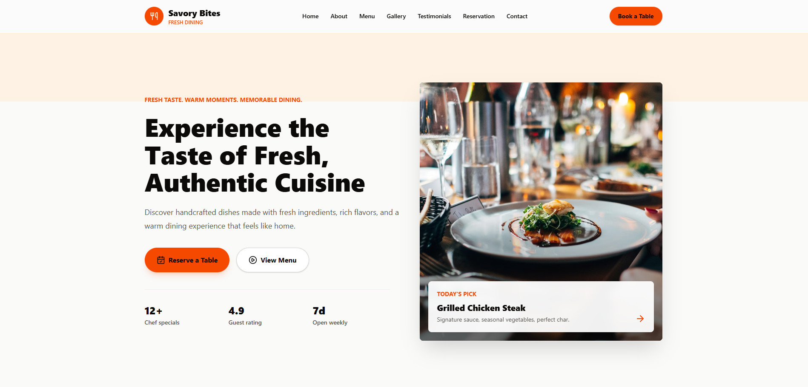
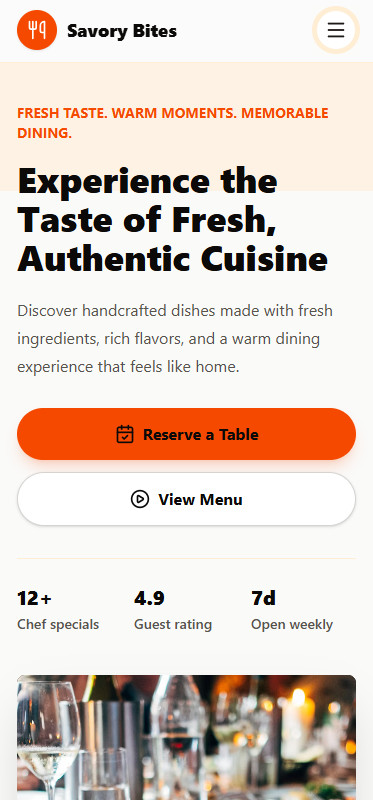

# Savory Bites Restaurant Landing Page

A professional, fully responsive restaurant landing page for **Savory Bites**. This project is built as a client-ready frontend delivery for restaurant, cafe, bistro, and food business landing page work.

**Live Website:** [restaurant-landing-page.shantopaul.com](https://restaurant-landing-page.shantopaul.com/)

**Repository:** [github.com/shantopaul/Restaurant-Landing-Page](https://github.com/shantopaul/Restaurant-Landing-Page)

## Preview

### Desktop View



### Mobile View



## Project Overview

Savory Bites is a modern restaurant landing page designed to promote a fictional food business, present its most popular dishes, build trust with customer testimonials, and allow visitors to submit a frontend-only table reservation request.

The website was created from a client-style requirement document and implemented with a professional component-based React structure. It is suitable for portfolio presentation, freelance gig proof, and restaurant landing page demonstrations.

## Main Objectives

- Build a polished restaurant website suitable for a real client presentation.
- Create a strong first impression with a responsive hero section and clear calls to action.
- Showcase restaurant story, menu items, gallery photos, testimonials, and contact details.
- Implement a working reservation form using React state and validation.
- Keep repeated content organized in reusable data files.
- Deliver a clean, maintainable, and deployment-ready frontend project.

## Features

- Fully responsive restaurant landing page
- Sticky desktop navigation
- Mobile hamburger menu
- Smooth scrolling navigation links
- Hero section with strong headline, description, food image, CTA buttons, and quick stats
- About section with restaurant story and feature highlights
- Popular menu section with food images, category labels, descriptions, and prices
- Responsive gallery grid with hover image effects
- Customer testimonial cards with avatars and star ratings
- Reservation form with controlled React state
- Required field validation
- Email format validation
- Guest count validation
- Success and error messages
- Clean footer with business information, opening hours, contact details, and social links
- Accessible image alt text and form labels
- GitHub Actions CI workflow for lint and production build checks

## Website Sections

- Navbar
- Hero
- About Savory Bites
- Popular Menu
- Food Gallery
- Customer Testimonials
- Reservation Form
- Footer / Contact

## Tech Stack

- React.js
- Vite
- Tailwind CSS
- Lucide React
- GitHub Actions
- Vercel / Custom domain deployment

## React Concepts Used

- Functional components
- Props
- React state
- Event handling
- Conditional rendering
- Array mapping
- Component composition
- Data-driven UI rendering
- Controlled form inputs

## Project Structure

```text
Restaurant-Landing-Page/
|-- .github/
|   `-- workflows/
|       `-- ci.yml                         # GitHub Actions quality workflow
|
|-- docs/
|   `-- screenshots/
|       |-- desktop-preview.jpg            # README preview: desktop layout
|       `-- mobile-preview.jpg             # README preview: mobile layout
|
|-- src/
|   |-- components/
|   |   |-- Navbar.jsx                     # Sticky navigation and mobile menu
|   |   |-- Hero.jsx                       # Hero headline, CTA buttons, stats, image
|   |   |-- About.jsx                      # Restaurant story and feature highlights
|   |   |-- Menu.jsx                       # Popular menu section wrapper
|   |   |-- MenuCard.jsx                   # Reusable food menu card
|   |   |-- Gallery.jsx                    # Responsive food gallery grid
|   |   |-- Testimonials.jsx               # Testimonial section wrapper
|   |   |-- TestimonialCard.jsx            # Reusable customer review card
|   |   |-- ReservationForm.jsx            # Booking form, validation, success state
|   |   |-- Footer.jsx                     # Contact details, hours, social links
|   |   `-- SectionHeader.jsx              # Reusable section heading component
|   |
|   |-- data/
|   |   |-- menuItems.js                   # Menu names, prices, categories, images
|   |   |-- galleryImages.js               # Gallery image URLs and alt text
|   |   |-- testimonials.js                # Customer review data
|   |   `-- siteContent.js                 # Restaurant info, nav links, hero/about assets
|   |
|   |-- App.jsx                            # Main page section composition
|   |-- index.css                          # Tailwind import and global styles
|   `-- main.jsx                           # React app entry point
|
|-- index.html                             # Vite HTML template
|-- package.json                           # Scripts and dependencies
|-- package-lock.json                      # Locked dependency versions
|-- vite.config.js                         # Vite and Tailwind plugin config
|-- eslint.config.js                       # ESLint configuration
`-- README.md                              # Project documentation
```

## Component Details

### `Navbar.jsx`

Responsive navigation with restaurant branding, desktop links, booking CTA, and mobile hamburger menu.

### `Hero.jsx`

First-view landing section with headline, supporting copy, CTA buttons, dining image, highlighted menu item, and quick restaurant stats.

### `About.jsx`

Restaurant story section with supporting image and feature highlights for freshness, chefs, atmosphere, and service.

### `Menu.jsx` and `MenuCard.jsx`

Data-driven popular menu section. Menu cards are generated from the `menuItems.js` data file.

### `Gallery.jsx`

Responsive image grid for food and restaurant atmosphere photos.

### `Testimonials.jsx` and `TestimonialCard.jsx`

Customer review section generated from the `testimonials.js` data file.

### `ReservationForm.jsx`

Frontend-only booking form with React state, validation, error handling, success message, and form reset after successful submission.

### `Footer.jsx`

Final business information section with address, phone, email, opening hours, social links, and copyright.

## Data Files

The project keeps repeated content separate from UI components:

- `menuItems.js` stores menu item data.
- `galleryImages.js` stores gallery image data.
- `testimonials.js` stores customer review data.
- `siteContent.js` stores restaurant metadata, navigation links, hero/about images, and feature highlights.

## Installation

```bash
npm install
```

## Run Locally

```bash
npm run dev
```

Then open the local URL shown in the terminal.

## Production Build

```bash
npm run build
```

## Preview Production Build

```bash
npm run preview
```

## Lint

```bash
npm run lint
```

## Deployment

This project is deployed at:

[https://restaurant-landing-page.shantopaul.com/](https://restaurant-landing-page.shantopaul.com/)

Recommended Vercel settings:

- Install command: `npm install`
- Build command: `npm run build`
- Output directory: `dist`

## Quality Checks

The project includes GitHub Actions CI. On push or pull request, the workflow:

- Installs dependencies
- Runs lint checks
- Builds the production app

Local verification completed:

- `npm run lint`
- `npm run build`
- Mobile responsive QA

## Responsive Design

The layout is optimized for:

- Desktop
- Tablet
- Mobile

Responsive behavior includes:

- Desktop horizontal navigation
- Mobile hamburger navigation
- Stacked hero layout on mobile
- Responsive menu card grid
- Responsive gallery grid
- Mobile-friendly form layout
- Clean footer stacking on smaller screens

## Accessibility

- Semantic page sections
- Accessible button labels
- Form labels for all inputs
- Descriptive image alt text
- Readable color contrast
- Keyboard-focus friendly form controls and buttons

## Future Improvements

- EmailJS integration for real reservation email delivery
- Google Maps location embed
- Framer Motion animations
- Online ordering section
- Admin dashboard for menu management
- Backend and database integration
- Table availability system
- Dark mode

## Contributions

Contributions are welcome. Anyone can suggest or work on:

- New restaurant landing page sections
- UI/UX improvements
- Responsive design fixes
- Accessibility improvements
- Performance optimization
- Reservation form enhancements
- Documentation improvements
- Bug fixes

### How to Contribute

1. Fork the repository.
2. Create a new feature branch.
3. Make the change with clean, readable code.
4. Run the quality checks:

```bash
npm run lint
npm run build
```

5. Open a pull request with a clear description of the change.

### Contributors

| Name | Email | Role |
| --- | --- | --- |
| Shanto Paul | [shanto@shantopaul.com](mailto:shanto@shantopaul.com) | Project Owner, Frontend Developer |

## Portfolio Description

A modern restaurant landing page built with React.js and Tailwind CSS. It includes a responsive hero section, about section, menu cards, image gallery, customer testimonials, reservation form, and business footer. The project is structured with reusable React components and data-driven rendering, making it clean, scalable, and client-ready.

## Contact

**Shanto Paul**  
Frontend Developer  
Email: [shanto@shantopaul.com](mailto:shanto@shantopaul.com)  
GitHub: [github.com/shantopaul](https://github.com/shantopaul)  
Website: [shantopaul.com](https://shantopaul.com)
